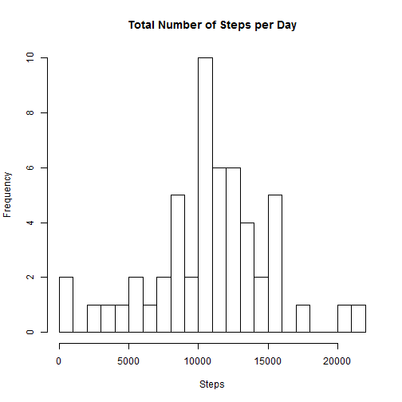
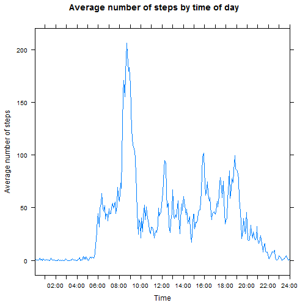
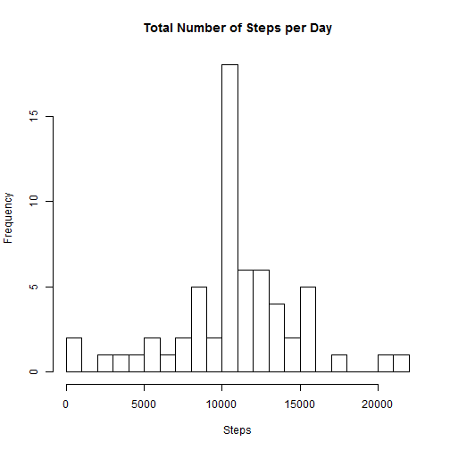
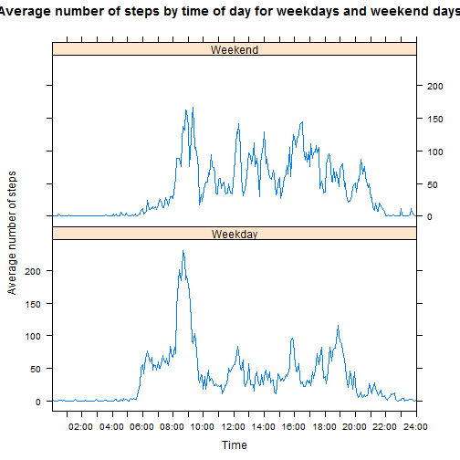

To start the analysis on the activity monitoring data set, first load the packages that will be needed for this analysis.


```r
require(plyr)
require(lattice)
```

Next, download and unzip the data, and read the data in to R.


```r
url <- "http://d396qusza40orc.cloudfront.net/repdata%2Fdata%2Factivity.zip"
download.file(url, "amd.zip")
unzip("amd.zip")
amd<-read.csv("activity.csv")
```

To get a better understanding of patterns in the number of steps, first calculate the total number of steps for each day, and then create a histogram displaying the totals. Calculate the mean and median number of steps taken per day.


```r
##Calculate the total number of steps on each day of data collection
amd1<-ddply(amd, "date", summarise, sum = sum(steps))

##Create a histogram displaying the number of steps per day
hist(amd1$sum, main="Total Number of Steps per Day", xlab="Steps")
```

 

```r
##Calculate the mean number of steps per day
m1<-mean(amd1$sum, na.rm=TRUE)

##Calculate the median number of steps per day
m2<-median(amd1$sum, na.rm=TRUE)
```

I also calculated the mean number of steps taken per day, which is 10766, and the median number of steps per day, which is 10765.

This data can also be used to understand patterns in the number of steps based on the time. To make the data easier to read, first format the interval data to display as times. Also convert it to a factor variable in order to ensure that the data displays neatly.


```r
amd$interval<-sprintf("%04d", amd$interval)
```

Now that the time data is a bit easier to understand, I can do some analysis. First any cases with missing values were excluded, then, the total number of steps taken at each specific time were averaged to provide a general idea of times of higher activity. This information was then plotted to show more active and less active times.


```r
##Remove missing data
amdsub<-amd[complete.cases(amd),]

##Calculate the mean number of steps for each time interval
amd2<-ddply(amdsub, "interval", summarize, mean=mean(steps))

##Change interval to a factor vector
amd2$interval<-as.factor(amd2$interval)

##Create a line plot
xyplot(amd2$mean~amd2$interval, type="l", xlab="Time", ylab="Average number of steps", main="Average number of steps by time of day", scales=list(x=list(at=seq(0000, 24000, 12), labels=c("00:00", "", "02:00","", "04:00", "", "06:00", "", "08:00", "", "10:00", "", "12:00", "", "14:00", "", "16:00", "", "18:00", "", "20:00", "", "22:00", "", "24:00"))))
```

 

```r
##Calculate the point with greatest activity
t1<-amd2$interval[which.max(amd2[,2])]
```

I also found the time with the peak activity, or the greatest average number of steps, which is 0835.

In order to get an idea of how much impact missing data points may have on the trends showing in the previous analyses, I first found the total number of missing data points.


```r
m3<-sum(is.na(amd))
print(m3)
```

```
## [1] 2304
```

Given the 2304 missing data points, trends in the data may be easier to spot if the missing points are replaced with an estimate. In this case I chose to use the average number of steps for each time interval to fill in missing data points at that time interval. After imputing the average number of steps for each time interval, I again calculated the total number of steps per day, and calculated the mean and median number of steps per day.


```r
##Merge the original data set with the set of average values created for the histogram, to create a new column indicating the average number of steps for each time interval
amd3<-merge(amd, amd2, by.x="interval", by.y="interval")

##Identify which rows have missing steps data
missing<-is.na(amd3$steps)

##Replace the value in the steps column with the mean value for rows with missing data
amd3$steps[missing]<-amd3$mean[missing]

##Remove duplicated and unnecessary information from the data set
amd3<-amd3[1:3]

##Calculate the total number of steps per day for the new data set
amd4<-ddply(amd3, "date", summarise, sum = sum(steps))

##Create a histogram to display the total number of steps per day with the missing data replaced with estimates
hist(amd4$sum, main="Total Number of Steps per Day", xlab="Steps")
```

 

```r
##Calculate the mean number of steps per day with the estimates for the missing data
m4<-mean(amd4$sum, na.rm=TRUE)

##Calculate the median number of steps per day with the estimates for the missing data
m5<-median(amd1$sum, na.rm=TRUE)
```

With the estimates replacing the NA values, the mean is now 10766, and the median is 10765. These values are the same as the mean and median calculated with missing data excluded. It is assumed that the estimates used to replace the missing data have not markedly skewed the data set.

Finally, we can look for trends in the data based on the day of the week. First, the date column, which is currently a factor variable, must be transformed into a date variable.


```r
amd3$date<-as.Date(as.character(amd3$date, "%m-%d-%Y"))
```

Next, I created a new column using the weekdays function to display the day of the week for each date of data collection. I then replaced the day in each row with either "Weekday", or "Weekend" as shown.


```r
amd3$weekday<-weekdays(amd3$date)
amd3$weekday<-gsub("Monday", "Weekday", amd3$weekday)
amd3$weekday<-gsub("Tuesday", "Weekday", amd3$weekday)
amd3$weekday<-gsub("Wednesday", "Weekday", amd3$weekday)
amd3$weekday<-gsub("Thursday", "Weekday", amd3$weekday)
amd3$weekday<-gsub("Friday", "Weekday", amd3$weekday)
amd3$weekday<-gsub("Saturday", "Weekend", amd3$weekday)
amd3$weekday<-gsub("Sunday", "Weekend", amd3$weekday)
```

Next I separated the data by the weekday column to create two data sets, one including only data from weekends, and one only data from weekdays. Then the mean number of steps for each time interval could be calculated for each set, and the resulting data sets merged to form a final data set including the means for each time and weekend or weekday combination.


```r
##Create a separate data set including only weekend days, and one including only weekdays
week<-subset(amd3, weekday=='Weekday')
weekend<-subset(amd3, weekday=='Weekend')

##Calculate the average number of steps for each time interval for weekend days and for weekdays
week2<-ddply(week, "interval", summarize, mean=mean(steps))
weekend2<-ddply(weekend, "interval", summarize, mean=mean(steps))

##Merge the average number of steps for each time interval into a new data set
week2$weekday<-"Weekday"
weekend2$weekday<-"Weekend"
amd5<-rbind(week2, weekend2)

##Change interval to a factor vector
amd5$interval<-as.factor(amd5$interval)

##Create a panel plot to display the average number of steps for each time interval over weekdays and weekend days
xyplot(amd5$mean~amd5$interval | amd5$weekday, layout=c(1,2), type="l", xlab="Time", ylab="Average number of steps", main="Average number of steps by time of day for weekdays and weekend days", scales=list(x=list(at=seq(0000, 24000, 12), labels=c("00:00", "", "02:00","", "04:00", "", "06:00", "", "08:00", "", "10:00", "", "12:00", "", "14:00", "", "16:00", "", "18:00", "", "20:00", "", "22:00", "", "24:00"))))
```

 

```r
##Calculate the time with maximum activity for both the weekend and weekday data sets
t2<-week2$interval[which.max(week2[,2])]
t3<-weekend2$interval[which.max(weekend2[,2])]
```

There are some notable differences in the activity patterns during the weekend from those during the week. One exampe of this is the differences in the peak times. For weekdays the time of maximum activity is 0835, the same as the overall peak time. For weekends the peak time is 0915. Activity over the weekend is on the whole a bit lower, but more steady.


